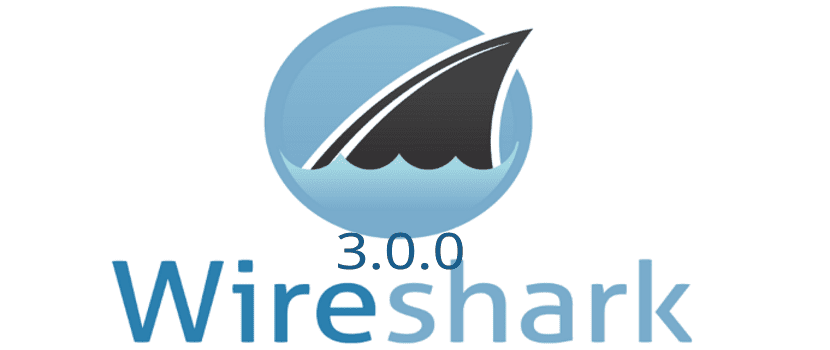

+++
title = 'Segundo Post De Bruno'
date = 2024-11-29T09:47:04+01:00
draft = false
+++
## ¿Qué es Wireshark?

**Wireshark** es una de las herramientas más populares y potentes para el análisis y monitoreo de redes. Es un analizador de protocolos de código abierto que permite capturar y visualizar el tráfico de una red en tiempo real, lo que lo convierte en una herramienta esencial para profesionales de redes y seguridad.

Wireshark es utilizado para diagnosticar problemas de red, analizar paquetes, aprender sobre protocolos y detectar posibles amenazas o actividades sospechosas.

---

## Principales Características

1. **Captura de Tráfico en Tiempo Real:**
   - Permite observar todo el tráfico que pasa por una interfaz de red seleccionada.
   - Compatible con múltiples formatos de captura como `.pcap`.

2. **Análisis Detallado de Protocolos:**
   - Reconoce y analiza cientos de protocolos como HTTP, TCP, UDP, DNS, ARP, y más.
   - Desglosa cada paquete en sus componentes, mostrando encabezados y datos.

3. **Filtros Avanzados:**
   - Permite aplicar filtros para centrarse en paquetes específicos o tipos de tráfico.
   - Ejemplo: Mostrar solo tráfico HTTP o paquetes provenientes de una IP específica.

4. **Exportación de Datos:**
   - Guarda capturas en múltiples formatos para análisis posterior.
   - Exporta estadísticas de la red en formatos legibles.

5. **Interfaz Gráfica Intuitiva:**
   - Visualización fácil de los datos capturados, con gráficos y tablas.

---

## ¿Cómo instalar Wireshark?

1. **Descarga:**
   - Ve al sitio oficial de [Wireshark](https://www.wireshark.org/download.html) y selecciona la versión adecuada para tu sistema operativo.

2. **Instalación:**
   - Sigue los pasos del asistente de instalación.
   - En sistemas Windows, se recomienda instalar **Npcap** para capturar paquetes.

3. **Requisitos del Sistema:**
   - **Windows:** 64-bit, 4 GB de RAM mínimo.
   - **Linux:** Disponible en repositorios oficiales (ejemplo: `sudo apt install wireshark` en Ubuntu).
   - **Mac:** Descarga la versión para macOS desde el sitio oficial.

4. **Configuración Inicial:**
   - Asegúrate de tener permisos de administrador o raíz para capturar tráfico en todas las interfaces.

---

## Ejemplo de Uso: Captura de Tráfico HTTP

### Pasos para Capturar Tráfico HTTP:

1. **Selecciona una Interfaz de Red:**
   - Abre Wireshark y selecciona la interfaz de red que deseas monitorear.

2. **Inicia la Captura:**
   - Haz clic en el botón "Start" para comenzar a capturar paquetes en tiempo real.

3. **Aplica un Filtro:**
   - En la barra de filtros, escribe:
     ```bash
     http
     ```
   - Esto mostrará solo los paquetes relacionados con tráfico HTTP.

4. **Analiza los Paquetes:**
   - Haz clic en un paquete para ver su desglose en el panel inferior.
   - Examina detalles como encabezados, contenido y protocolos involucrados.

5. **Detén y Guarda la Captura:**
   - Haz clic en "Stop" y guarda el archivo en formato `.pcap` para análisis posterior.

---

## Consejos de Seguridad

- **Captura de tráfico propio:** Captura solo en redes donde tienes permiso. El monitoreo de redes sin autorización puede ser ilegal.
- **Cifrado:** Recuerda que el tráfico HTTPS está encriptado, por lo que no podrás ver el contenido directamente.

---

## Conclusión

Wireshark es una herramienta esencial para cualquier profesional o estudiante interesado en redes y seguridad. Su capacidad para capturar y analizar tráfico en tiempo real lo convierte en un recurso valioso para diagnosticar problemas, entender protocolos y aprender más sobre cómo funcionan las redes.

¿Listo para explorar el tráfico de tu red? ¡Descarga Wireshark y comienza a capturar!

---

### Recursos Adicionales

- [Sitio Oficial de Wireshark](https://www.wireshark.org/)
- [Guía de Filtros Wireshark](https://wiki.wireshark.org/DisplayFilters)
- [Documentación Oficial de Wireshark](https://www.wireshark.org/docs/)